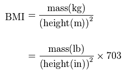

## Presentation Scheme

1. What is BMI?
2. BMI Calculation
3. BMI Ranges

--- .class #id

## Body Mass Index (BMI)

1. The body mass index (BMI), or Quetelet index, is a measure of relative weight based on an individual's mass and height
2. Devised between 1830 and 1850 by the Belgian polymath Adolphe Quetelet
3. It is a simple method to assess how much an individual's body weight departs from what is normal or desirable for a person of his or her height

---

## BMI Calculation



---

## BMI Ranges

```{r setup, message = F, echo = F, cache=F}
require(rCharts)
knitr::opts_chunk$set(comment = NA, results = 'asis', tidy = F, message = T)
```
```{r chart1, echo=FALSE}
bmidata <- read.table(text = "criteria index group 
                              BMI 18 under-weight
                              BMI 0.5 thin-for-height
                              BMI 6.4 healthy-weight
                              BMI 5 over-weight", header = TRUE)
    bmiIndex <- subset(as.data.frame(bmidata))
n1 <- nPlot(index ~ criteria, group = "group", data = bmiIndex, type = "multiBarChart")
n1$chart(stacked = TRUE)
n1$print("chart3")
```
---


