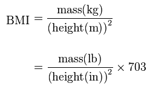

## Presentation Scheme

1. What is BMI?
2. BMI Calculation
3. BMI Ranges

--- .class #id

## Body Mass Index (BMI)

1. The body mass index (BMI), or Quetelet index, is a measure of relative weight based on an individual's mass and height
2. Devised between 1830 and 1850 by the Belgian polymath Adolphe Quetelet
3. It is a simple method to assess how much an individual's body weight departs from what is normal or desirable for a person of his or her height

---

## BMI Calculation

---

## BMI Ranges

---

